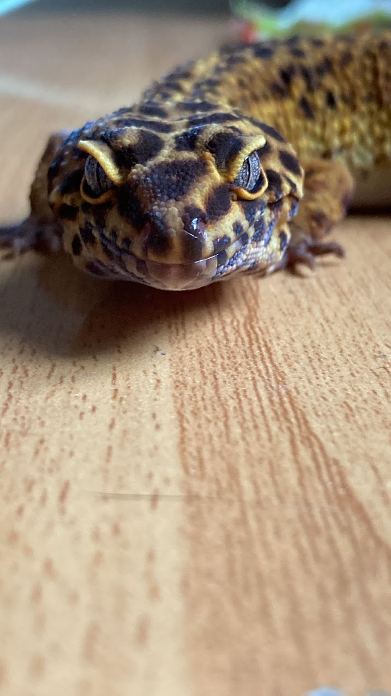

# Gecko Controller

A Raspberry Pi-based temperature, light, and UV controller for gecko vivarium monitoring and control.

<div align="center">
  
  <p><em>Diablo the Leopard Gecko, for whom this controller was built</em></p>
</div>

## Features

- Real-time temperature and humidity monitoring via SHT31 sensor
- UV spectrum monitoring (UVA/UVB/UVC) via AS7331 sensor
- Automated light cycle control with configurable schedules
- Temperature-based heating control with day/night settings
- OLED status display showing:
  - Current time
  - Temperature and humidity readings
  - Target temperature
  - UV levels with status indicators
  - Light and heat status
  - Time until next light transition
- Web interface for:
  - Real-time environmental monitoring
  - Temperature and light schedule configuration
  - Historical data visualization
  - Mobile-friendly responsive design
- Logging of environmental conditions
- MQTT Home Assistant integration with auto-discovery
  - Automatic sensor entity creation
  - Real-time data publishing
  - No manual configuration required

## Hardware Requirements

- Raspberry Pi (any model with GPIO pins)
- SSH1106 OLED Display (I2C interface)
- SHT31 Temperature/Humidity Sensor
- AS7331 Spectral UV Sensor
- DS3231 Real-Time Clock (I2C interface, address 0x68)
- 2x Relay modules (for light and heat control)
- Compatible 5V power supply
- I2C-compatible cables and connectors

## Installation

### Method 1: Using the Debian Package (Recommended)

1. Enable I2C and configure RTC on your Raspberry Pi:
   ```bash
   sudo raspi-config
   # Navigate to Interface Options > I2C > Enable
   
   # Add RTC overlay to /boot/firmware/config.txt:
   echo "dtoverlay=i2c-rtc,ds3231" | sudo tee -a /boot/firmware/config.txt
   
   # Reboot for changes to take effect
   sudo reboot
   ```

2. Install the package:
   ```bash
   sudo apt update
   sudo apt install gecko-controller
   ```

3. The controller service will start automatically. Check its status with:
   ```bash
   sudo systemctl status gecko-controller
   ```

4. Start and enable the web interface:
   ```bash
   sudo systemctl start gecko-web
   sudo systemctl enable gecko-web
   ```

### Method 2: Running from Source

1. Enable I2C as described above

2. Clone the repository:
   ```bash
   git clone https://github.com/yourusername/gecko-controller.git
   cd gecko-controller
   ```

3. Install required packages:
   ```bash
   python3 -m pip install RPi.GPIO smbus2 Pillow Flask paho-mqtt
   ```

4. Run the controller:
   ```bash
   python3 gecko_controller/controller.py
   ```

5. In a separate terminal, run the web interface:
   ```bash
   python3 -m gecko_controller.web.app
   ```

## Web Interface

The web interface is accessible at `http://<raspberry-pi-ip>/` and provides:

- Real-time monitoring dashboard
  - Current temperature and humidity
  - UV levels with status indicators
  - Light and heat status
- Historical data graphs
  - Temperature and humidity trends
  - UV exposure levels
- Configuration panel
  - Temperature thresholds
  - Light schedule
  - UV warning levels

## Configuration

Create or modify `/etc/gecko-controller/config.py` with your settings:

```python
# Gecko Controller Configuration File
# This file will be installed to /etc/gecko-controller/config.py
# You can modify these values to customize your gecko enclosure settings
# The service must be restarted after changes: sudo systemctl restart gecko-controller

# Display I2C
DISPLAY_ADDRESS = 0x3c

# GPIO Pins
LIGHT_RELAY = 17
HEAT_RELAY = 4
DISPLAY_RESET = 21

# Temperature Settings
MIN_TEMP = 15.0
DAY_TEMP = 30.0
TEMP_TOLERANCE = 1.0

# Time Settings
LIGHT_ON_TIME = "07:30"
LIGHT_OFF_TIME = "19:30"

# UV Thresholds # μW/cm²
UVA_THRESHOLDS = {
    'low': 50.0,
    'high': 100.0
}

UVB_THRESHOLDS = {
    'low': 2.0,
    'high': 5.0
}

# UV View Factor Correction
SENSOR_HEIGHT = 0.2
LAMP_DIST_FROM_BACK = 0.3
ENCLOSURE_HEIGHT = 0.5
SENSOR_ANGLE = 90

# MQTT Settings for Home Assistant Integration
MQTT_ENABLED = True
MQTT_BROKER = "homeassistant.local"
MQTT_PORT = 1883
MQTT_USERNAME = "mqtt"
MQTT_PASSWORD = "mqtt"
MQTT_TOPIC_PREFIX = "gecko"
MQTT_DEVICE_ID = "gecko_controller"
MQTT_PUBLISH_INTERVAL = 60  # seconds
```

## GPIO Wiring

| Component          | GPIO Pin | Notes                    |
|-------------------|----------|--------------------------|
| Light Relay       | GPIO 4   | Active HIGH for ON       |
| Heat Relay        | GPIO 17  | Active HIGH for ON       |
| Display Reset     | GPIO 21  | Optional, HIGH for normal|
| I2C SDA           | GPIO 2   | For all I2C devices      |
| I2C SCL           | GPIO 3   | For all I2C devices      |

## Home Assistant MQTT Integration

The gecko controller automatically publishes sensor data to Home Assistant via MQTT with zero configuration required on the Home Assistant side.

### Setup

1. Ensure MQTT is enabled in your Home Assistant installation
2. Configure MQTT settings in `/etc/gecko-controller/config.py`
3. Restart the gecko-controller service:
   ```bash
   sudo systemctl restart gecko-controller
   ```

### Testing MQTT Connection

```bash
cd /home/ian/gecko-controller
python3 test_mqtt.py
```

To remove test devices if needed:
```bash
python3 cleanup_mqtt_test.py
```

### Available Sensors

The following sensors will automatically appear in Home Assistant:
- **Temperature** - Current vivarium temperature (°C)
- **Humidity** - Current humidity level (%)
- **UVA Level** - UVA radiation (μW/cm²)
- **UVB Level** - UVB radiation (μW/cm²)
- **UVC Level** - UVC radiation (μW/cm²)
- **Light Relay** - Light relay control state (ON/OFF based on schedule)
- **Heat Relay** - Heat relay control state (ON/OFF based on temperature)
- **Target Temperature** - Current temperature setpoint (°C)

### Troubleshooting MQTT

- **No device in Home Assistant**: Check MQTT broker connectivity with `python3 test_mqtt.py`
- **Duplicate devices**: Run `python3 cleanup_mqtt_test.py` to remove test devices
- **No data updates**: Verify service is running: `sudo systemctl status gecko-controller`
- **Connection issues**: Check firewall rules and ensure port 1883 is accessible

## Troubleshooting

1. Check I2C devices are detected:
   ```bash
   sudo i2cdetect -y 1
   # Expected devices:
   # 0x3c - OLED Display
   # 0x44 - SHT31 Temperature/Humidity Sensor  
   # 0x68 - DS3231 RTC
   # 0x74 - AS7331 UV Sensor
   ```
   
2. Verify RTC is working:
   ```bash
   # Check if RTC device exists
   ls -la /dev/rtc*
   
   # Read hardware clock time
   sudo hwclock --show
   
   # Check system time configuration
   timedatectl status
   ```

3. View service logs:
   ```bash
   journalctl -u gecko-controller -f
   ```

4. Common issues:
   - If display shows no data, check I2C connections and addresses
   - If UV readings show as "None", verify AS7331 sensor connection
   - For temperature/humidity errors, check SHT31 sensor wiring
   - If time is incorrect after reboot:
     - Ensure RTC overlay is in `/boot/firmware/config.txt`: `dtoverlay=i2c-rtc,ds3231`
     - Verify RTC is detected at address 0x68 with `sudo i2cdetect -y 1`
     - Check RTC battery voltage (should be ~3V)

## Contributing

1. Fork the repository
2. Create your feature branch (`git checkout -b feature/amazing-feature`)
3. Commit your changes (`git commit -m 'Add some amazing feature'`)
4. Push to the branch (`git push origin feature/amazing-feature`)
5. Open a Pull Request

## License

This project is licensed under the MIT License - see the LICENSE file for details.

## Support

For issues, questions, or contributions, please open an issue on the GitHub repository.