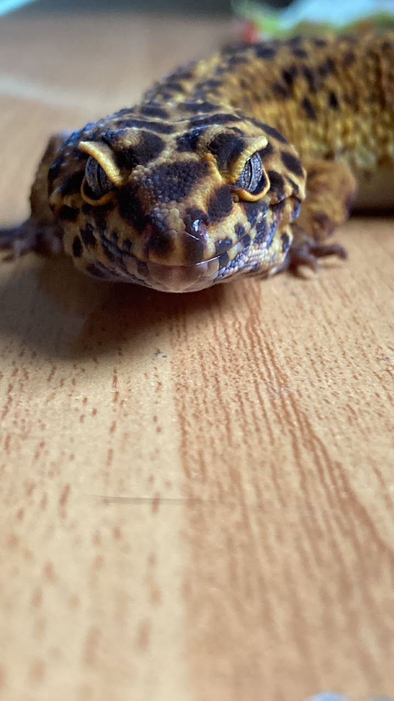
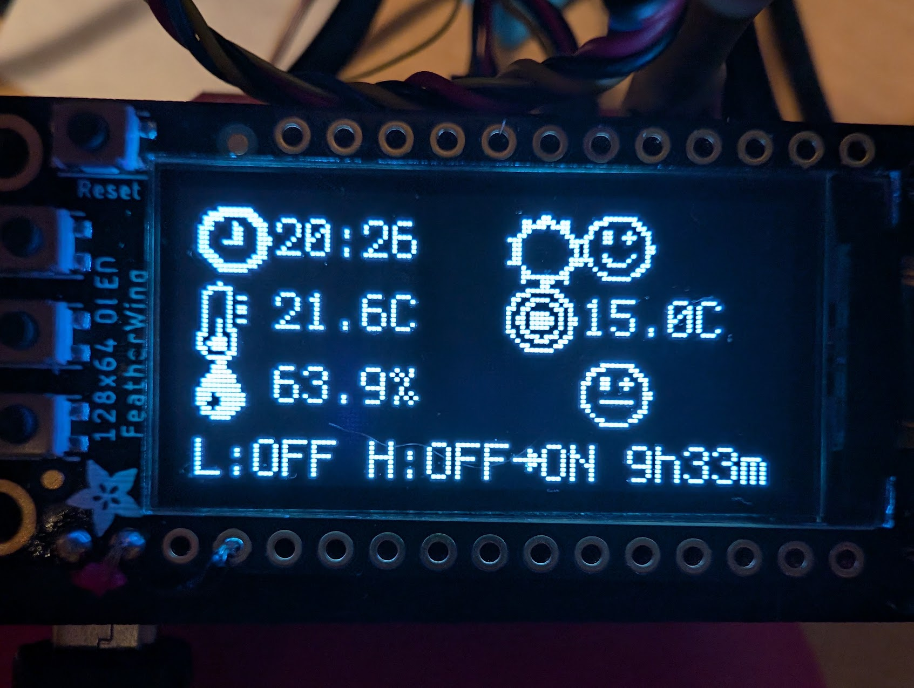

# Gecko Controller

A Raspberry Pi-based temperature, light, and UV controller for gecko enclosure monitoring and control.

<div align="center">
  
  <p><em>Diablo the Leopard Gecko, for whom this controller was built</em></p>
</div>

## Overview

This project provides automated environmental control and monitoring for a gecko enclosure, with real-time feedback via an OLED display.

<div align="center">
  
  <p><em>The OLED display showing temperature, humidity, UV levels, and system status</em></p>
</div>

## Features

- Real-time temperature and humidity monitoring
- UV light level monitoring (UVA and UVB)
- Automated light cycle control
- Temperature-based heating control
- OLED display showing:
  - Current time
  - Temperature and humidity readings
  - Target temperature
  - UV status indicators
  - Light and heat status
  - Time until next light transition

## Hardware Requirements

- Raspberry Pi (tested on Pi Zero 2 W)
- SH1107 OLED Display (I2C)
- SHT31 Temperature/Humidity Sensor
- AS7331 Spectral UV Sensor
- Relay modules for light and heat control
- Compatible power supply

## Installation

### From Debian Package

1. Download the latest .deb package from the releases page:
```bash
wget https://github.com/YOUR-USERNAME/gecko-controller/releases/latest/download/gecko-controller_X.Y.Z_all.deb
```

2. Install the package and its dependencies:
```bash
sudo apt install ./gecko-controller_X.Y.Z_all.deb
```

The installation will:
- Install required Python dependencies
- Set up the systemd service
- Create configuration directory at `/etc/gecko-controller`

### Service Management

Start the service:
```bash
sudo systemctl start gecko-controller
```

Enable automatic start at boot:
```bash
sudo systemctl enable gecko-controller
```

Check service status:
```bash
sudo systemctl status gecko-controller
```

View service logs:
```bash
sudo journalctl -u gecko-controller
```

## Configuration

The configuration file is located at `/etc/gecko-controller/config.py`. You can adjust:

- `MIN_TEMP`: Minimum (night) temperature
- `DAY_TEMP`: Target daytime temperature
- `TEMP_TOLERANCE`: Temperature control deadband
- `LIGHT_ON_HOUR`: Hour to turn lights on (24-hour format)
- `LIGHT_OFF_HOUR`: Hour to turn lights off (24-hour format)

After changing the configuration, restart the service:
```bash
sudo systemctl restart gecko-controller
```

## GPIO Pin Configuration

Default GPIO assignments:
- Light Relay: GPIO 4
- Heat Relay: GPIO 17
- Display Reset: GPIO 21

## Building from Source

1. Install build dependencies:
```bash
./install_build_deps.sh
```

2. Build the Debian package:
```bash
dpkg-buildpackage -us -uc
```

The built package will be created in the parent directory.

## Contributing

1. Fork the repository
2. Create your feature branch (`git checkout -b feature/amazing-feature`)
3. Commit your changes (`git commit -m 'Add some amazing feature'`)
4. Push to the branch (`git push origin feature/amazing-feature`)
5. Open a Pull Request

## License

This project is licensed under the MIT License - see the LICENSE file for details.
